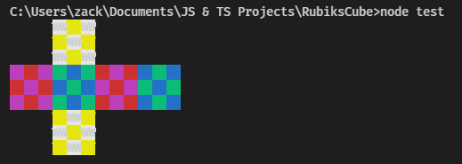

# Rubik's Cube
A Rubik's Cube simulator written in TypeScript (Node.js) for the terminal.

```sh
npm i --save @faztasio/rubikscube
```


```js
const cubelib = require('rubikscube');

const cube = cubelib.createCube();
cubelib.exec(cube, 'R2 L2 F2 B2 D2 U2');
cubelib.render(cube);
```

**Currently only supports the 3x3 Rubik's Cube.**  Support for larger and smaller cubes may or may not be added in the future.

## API
### Import
```ts
// TypeScript
import * as cubelib from 'rubikscube';
```

```js
// Plain JavaScript
const cubelib = require('rubikscube');
```

### Create a Cube
```ts
const mainCube = cubelib.createCube();
```

### Execute an Algorithm
```ts
cubelib.exec(mainCube, `R U R' U'`);
```

### Render to Terminal
```ts
cubelib.render(mainCube);
```